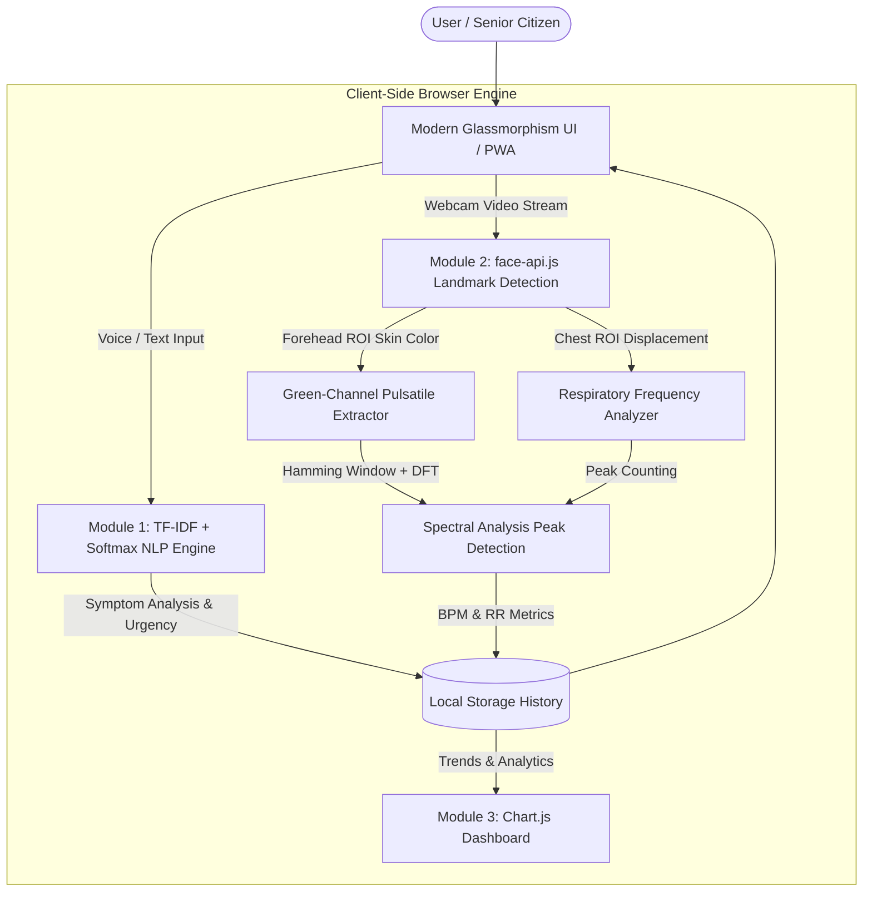

# 🌿 Vitalis AI — Next-Gen Elderly Health Companion & Non-Invasive Vital Scanner

[](LICENSE)
[]()
[]()

> **Vitalis AI** is an end-to-end, zero-latency, privacy-first health monitoring web application built specifically for senior citizens. It combines **Client-Side Natural Language Processing (NLP)** for symptom triage with **Photoplethysmography (rPPG)** via standard webcams for real-time, contact-free vital sign estimation.

---

## 🌟 Key Features

### 1. 🩺 AI Health Symptom Triage (Module 1)

- **Zero-Server Inference**: Runs a custom-trained Logistic Regression + TF-IDF classification model 100% locally in JavaScript.
- **Multilingual / Indonesian NLP**: Analyzes free-text or voice-dictated symptom descriptions (e.g., "Dada sesak, pusing, lemas") and classifies them into **8 disease categories** and **3 clinical urgency levels** (_Normal_, _Warning_, _Emergency_).
- **Geometric Confidence Scoring**: Provides real-time probability estimates and certainty metrics for every prediction.
- **Voice Dictation & Speech Feedback**: Hands-free voice input via Web Speech STT and clear voice feedback using TTS.

### 2. 🫀 Contact-Free Vital Sign Scanner (Module 2)

- **Facial Landmark Tracking**: Powered by `face-api.js` (TinyFaceDetector) to isolate high-perfusion facial ROI (Region of Interest) on the forehead and upper cheek regions.
- **Remote Photoplethysmography (rPPG)**: Detects subtle micro-color variations in facial skin tissue caused by pulsatile blood flow using dynamic green-channel optical filtering.
- **Chest Motion Respiration Tracking**: Analyzes vertical periodic displacements of body ROI to compute Respiratory Rate (RR in bpm).
- **Live Signal Charting**: Displays real-time filtered photoplethysmographic wave cycles on an interactive canvas chart using Chart.js.
- **Signal Quality Metrics**: Employs a pre-processing Hamming window function and Discrete Fourier Transform (DFT) spectral peak analysis to compute Signal-to-Noise Ratio (SNR) and Heart Rate (HR in BPM).

### 3. 📊 Health Analytics Dashboard (Module 3)

- **Historical Health Trends**: Visualizes vital sign trends (Heart Rate & Respiratory Rate) over time with interactive Chart.js line graphs.
- **Triage Breakdown**: Doughnut chart rendering proportion of Emergency, Warning, and Normal health assessments.
- **Export & Portability**: Single-click export of complete diagnostic history to CSV format for medical professionals.
- **Local Persistence**: Zero-cloud data storage using standard browser `localStorage` ensuring 100% patient data privacy and HIPAA/GDPR alignment.

### 4. ♿ Senior-Centric Accessibility & PWA

- **Adjustable Typography**: Instant font scaling (`Standard`, `Large`, `Extra Large`) tailored for visual impairments.
- **Progressive Web App (PWA)**: Works completely offline with Service Worker caching and standalone home screen installation.
- **High-Contrast Dark Mode & Glassmorphism UI**: High legibility, large touch targets, accessible color contrast ratios (WCAG AAA), and semantic ARIA labeling.

---

## 🏗️ Technical Architecture



---

## 🛠️ Tech Stack

- **Frontend Core**: Semantic HTML5, Modern CSS3 (CSS Custom Properties, Flexbox/Grid, Glassmorphism, CSS Animations), Vanilla JavaScript (ES6+).
- **Machine Learning & Computer Vision**:
  - `face-api.js` (TensorFlow.js backend under the hood) for real-time face detection.
  - Custom JavaScript Scikit-Learn Exporter for local TF-IDF vectorization & multinomial logistic regression.
  - Signal processing algorithms: Moving Average Smoothing, Hamming Windowing, Discrete Fourier Transform (DFT).
- **Visualization**: `Chart.js` for real-time signal waveforms and dynamic health analytics.
- **Accessibility & Speech**: Web Speech API (`SpeechRecognition` & `SpeechSynthesis`).
- **PWA Capabilities**: Service Worker API, Web App Manifest.

---

## 🚀 Getting Started

### Prerequisites

- Any modern web browser (Google Chrome, Microsoft Edge, Brave, Firefox, or Safari).
- A functional webcam (for Module 2 Vital Scanner) and microphone (for Voice Dictation).

### Installation & Running Locally

Because the application loads deep learning model weights (`tiny_face_detector_model-weights_manifest.json`) and Service Workers, it must be served via an HTTP/HTTPS web server (rather than opened via `file://`).

#### Option 1: Python HTTP Server (Recommended)

```bash
# Clone or open project directory
cd "path/to/Young Coder World Competition 2026"

# Python 3
python -m http.server 8000
```

Then open your browser and navigate to `http://localhost:8000`.

#### Option 2: VS Code Live Server

1. Install the **Live Server** extension in VS Code.
2. Right-click `index.html` and click **"Open with Live Server"**.

#### Option 3: Node.js `serve`

```bash
npx serve .
```

---

## 📊 Machine Learning Model Details

The NLP classification model (`model/model.json`) was trained on clinical symptom records using Python's `scikit-learn`:

- **Vectorization**: TF-IDF Vectorizer (sublinear TF scaling).
- **Classifier**: Logistic Regression with L2 Regularization ($C=1.0$).
- **Export Format**: Standard JSON payload containing vocabulary dictionary, IDF weights, class labels, model intercept vectors, and coefficient matrix.
- **Inference**: Custom pure-JS engine calculating dot products against IDF vectors followed by Softmax normalization for calibrated probability distributions.

To retrain or extend the dataset, modify `machine_learning.py` and execute:

```bash
python machine_learning.py
```

---

## 🔒 Privacy & Security

- **100% Local Processing**: Video frames from the webcam and user text input **NEVER** leave the user's browser. No cloud APIs, external trackers, or remote servers are contacted during scan or diagnostic sessions.
- **Data Retention**: All health history records are stored exclusively in the browser's `localStorage` and can be wiped instantly via the "Clear All History" button in the Analytics Dashboard.

---

## 🏆 Young Coder World Competition 2026

This project was engineered for the **Young Coder World Competition 2026** under the **Health Tech & AI for Social Good** track. It demonstrates how modern web technologies and client-side AI can bridge the healthcare accessibility gap for vulnerable demographic groups.

### Authors / Team

- **Ahmad Rayhan Faizul Haq (Grade 12)**

### License

This project is licensed under the MIT License - see the [LICENSE](LICENSE) file for details.
